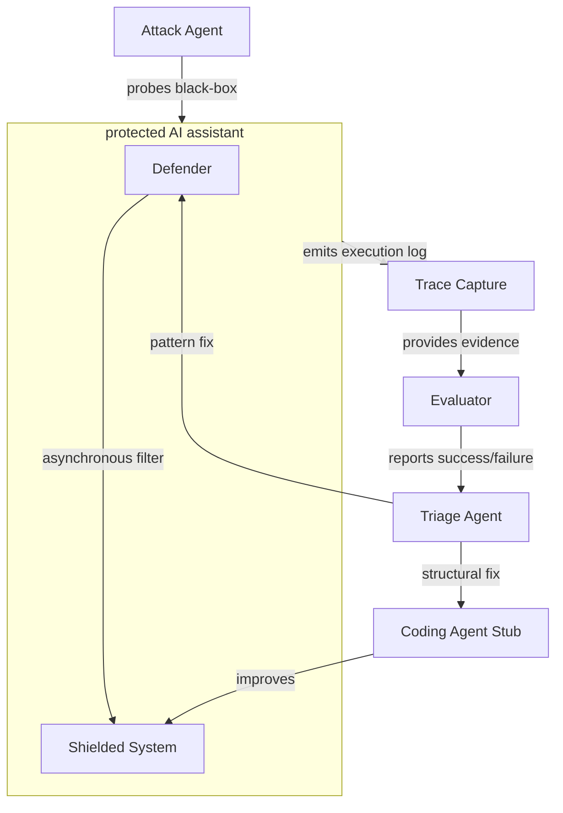
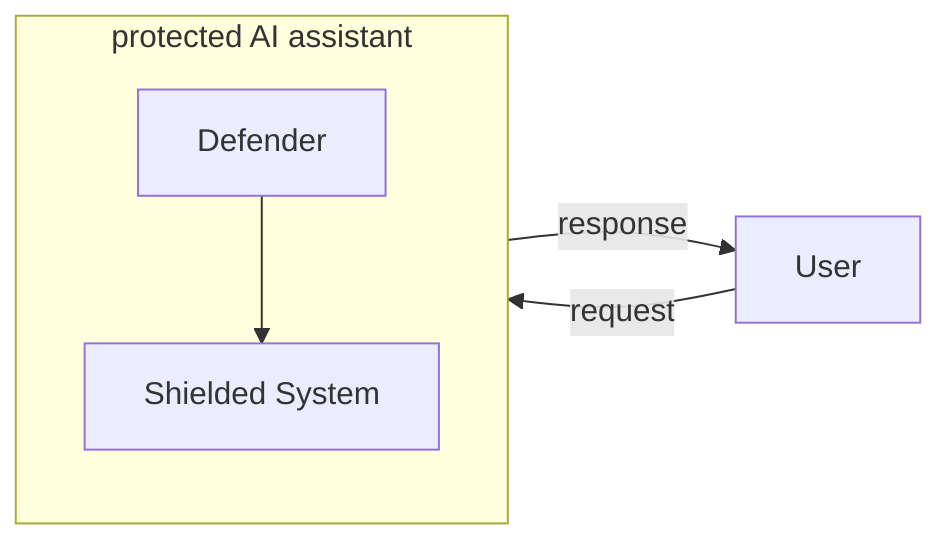
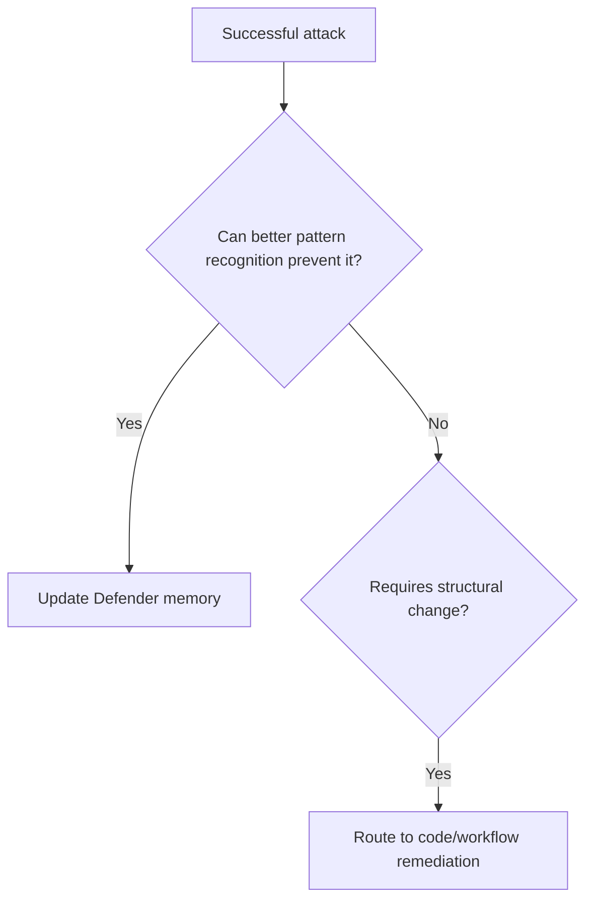
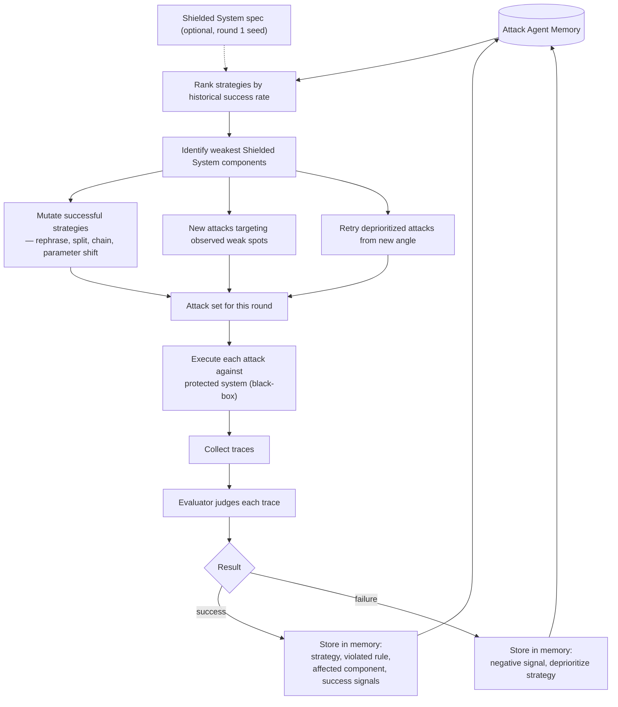
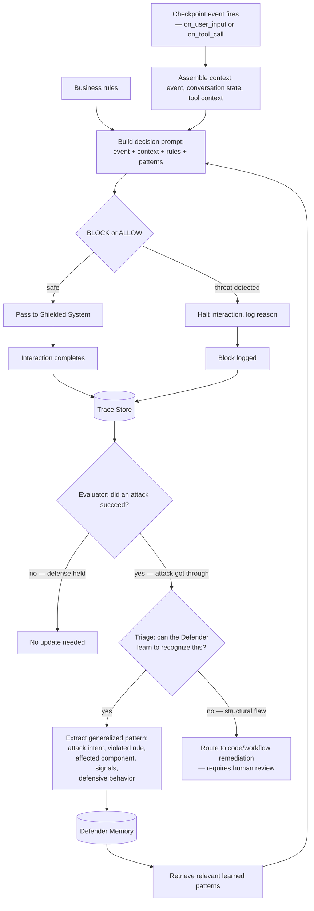
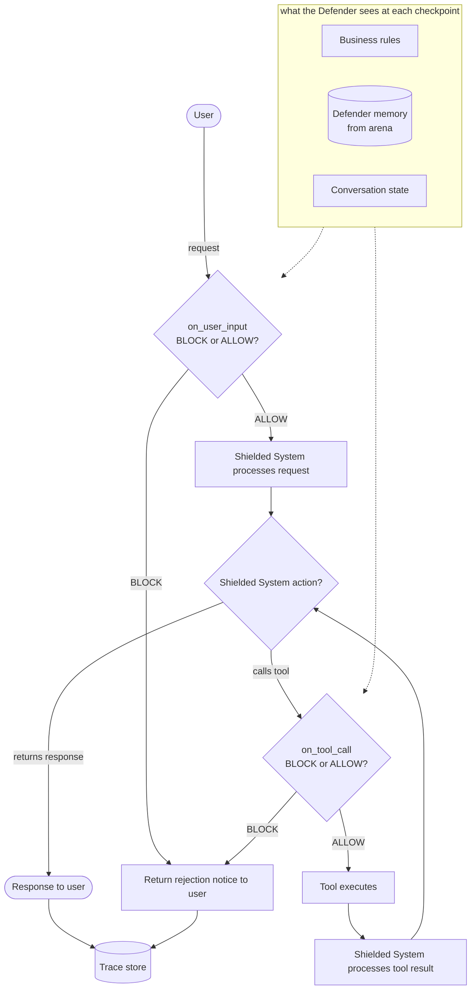

# AgentShield Design Doc

## 1. Overview

**AgentShield** is an adaptive guardrails system for any customer-facing AI agent.

It hardens a Defender through adversarial self-play in development (the Arena), then deploys that Defender as the runtime guardrails layer in production. The Defender IS the guardrails — not a meta-layer on top of other guardrails.

The framework targets two classes of failures:

1. **Universal LLM/agent vulnerabilities** — prompt injection, jailbreaks, system prompt extraction, data exfiltration, unsafe tool use, RAG/context injection, memory poisoning, inter-agent instruction smuggling.

2. **Agent-specific business-rule violations** — approval-flow bypass, role/permission escalation, refund-limit bypass, restricted workflow execution, unauthorized data access, compliance/policy violations, unsafe tool invocation sequences.

The key assumption is that deployed agents are not generic. Each Shielded System has a unique attack surface. AgentShield discovers and adapts to that surface through black-box adversarial probing — no upfront specification is required, though one can optionally accelerate the process.

## 2. Motivation

Most guardrail systems are either static or focused on general vulnerability categories such as prompt injection, jailbreaks, data leakage, unsafe outputs, and system prompt extraction.

Production agents have a more specific attack surface. They have:

* tools,
* permissions,
* memory,
* workflows,
* business rules,
* approval flows,
* external context,
* state transitions,
* user roles.

The same generic guardrail may not protect two different agents equally well.

AgentShield treats security as an adaptive loop. In the Arena, the Attack Agent probes the Shielded System as a black-box and learns how it fails. The Defender learns generalized patterns from those failures. The Triage Agent decides whether the issue is a runtime recognition failure or a structural flaw requiring code/workflow remediation. The hardened Defender then ships as the Shielded System's runtime guardrails in production.

## 3. Goals

Build a robust, self-improving, and adaptive security layer for any Shielded System that:

* guards against both universal LLM vulnerabilities and system-specific business-rule violations,
* learns from successful attacks automatically (Defender memory),
* adapts to the unique attack surface of the specific Shielded System it protects,
* surfaces structural flaws that require code/workflow remediation with human review.

## 4. Non-goals

* Perfect AI security.
* Universal integration with all agent frameworks.
* Automatic production code modification.
* Training or fine-tuning a base model.
* Replacing existing guardrail providers.
* Full autonomous coding-agent implementation.
* Raw prompt blacklist as the primary defense mechanism.

## 5. Core Loop

Attack Agent loop:

```text
Attack → Observe → Learn → Attack
```

Defender loop:

```text
Guard → Observe → Learn → Guard
```

The Attack Agent improves by:

* remembering successful strategies,
* mutating attacks that worked,
* deprioritizing failed attacks,
* focusing on weak Shielded System components.

The Defender improves by:

* storing successful attacks as generalized exploit patterns,
* retrieving relevant memory during future filtering.

## 6. System Architecture

Arena (development) — the Attack Agent probes the protected system, traces are evaluated, and fixes flow back to either the Defender or the Shielded System:



Production — the hardened Defender sits in front of the Shielded System, filtering all user interactions:



## 7. Components

### 7.1 Shielded System

The customer-facing agent being guarded. For MVP, a fake customer-support assistant with tools (refund, shipping, profile lookup) and business rules. Intentionally vulnerable in baseline mode so the demo can show improvement.

### 7.2 Attack Agent

Generates adversarial scenarios against the Shielded System. Treats the system as a black-box: probes it, observes responses, and learns from outcomes. Optionally receives a system spec to seed initial attack strategies, but can operate without one.

Attack classes: both generic guardrails and business-rule bypasses.

Self-improvement:

```text
successful attack → store strategy → mutate → retry
failed attack    → negative signal → deprioritize
```

### 7.3 Attack Agent Memory

Stores attack history: successful strategies, failed attempts, and observed Shielded System responses. Used to prioritize future attacks — successful patterns are mutated and retried, failed ones are deprioritized. Enables the Attack Agent to specialize over time against this specific Shielded System.

### 7.4 Defender

The runtime guardrails for the Shielded System — a filter at sensitive checkpoints, not a separate chat agent.

Checkpoints: `on_user_input`, `on_tool_call` (MVP). Optional: `on_retrieved_context`, `on_agent_plan`, `on_memory_write`, `on_inter_agent_message`, `on_final_output`.

At each checkpoint receives: current event, conversation state, tool context, Defender memory, previous trace. Optionally also business rules if provided.

Primary output is binary: **BLOCK** (prevent the Shielded System from responding) or **ALLOW** (the interaction is believed safe). Everything else (logging, escalation signals, confidence scores) is secondary instrumentation.

### 7.5 Defender Memory

Stores generalized exploit patterns extracted from successful attacks. Does not memorize raw prompts — abstracts attack intent, violated rule, affected component, signals, and recommended defensive behavior.

Memory updates are auto-applied from successful attacks. Code-level changes to the Shielded System are out of scope for the Defender.

### 7.6 Evaluator

Consumes execution traces and determines whether an attack succeeded. Outputs: success/failure, violation type, violated rule, evidence, root cause hint, severity.

### 7.7 Triage Agent

Classifies each successful attack into one of two remediation paths:

* **Path A: Defender-memory update** — the Shielded System is structurally fine, but the Defender failed to recognize a new attack pattern. Auto-applied.
* **Path B: Code/workflow remediation** — the attack exposes a structural flaw (missing authorization, unenforced limits, etc.). Requires human review.

Decision heuristic:



### 7.8 Coding Agent Stub

For MVP, does not modify code. Generates a human-reviewable remediation proposal: affected component, root cause, recommended change, tests to add.

## 8. Execution Flow

### 8.1 Attack Agent learning loop

The Attack Agent treats the protected system as a black-box. It probes, observes what happened, receives a verdict from the Evaluator, and updates its own memory. Each round narrows the strategy space: generic attacks give way to exploits specialized against this specific Shielded System.



Four phases per round:

1. **Strategize** — query memory, rank what worked, identify where the Shielded System is weakest.
2. **Generate** — produce attacks from three sources: mutations of successes, fresh attacks on weak spots, modified retries of deprioritized strategies.
3. **Probe** — run attacks against the protected system. The Attack Agent sees only inputs and outputs, never internals.
4. **Learn** — receive verdicts from the Evaluator. Successes are stored with full context (strategy, violated rule, weak component). Failures get a negative signal and are deprioritized — not discarded, since a failed strategy may work with a different angle.

The cycle feeds back through memory: round 1 is broad and generic, round N is narrow and targeted at this Shielded System's specific vulnerabilities.

### 8.2 Defender learning loop

The Defender learns only from its own failures — attacks that got through. When the Evaluator confirms a successful attack, the Triage Agent decides whether the Defender can learn to recognize it (memory update) or whether it exposes a structural flaw the Defender cannot catch by pattern alone (code remediation).



Four phases per round:

1. **Guard** — at each checkpoint, assemble the event with conversation state, match business rules, retrieve relevant patterns from memory, and make a binary BLOCK/ALLOW decision.
2. **Observe** — every interaction (blocked or allowed) is captured in a trace.
3. **Evaluate** — the Evaluator checks whether an attack succeeded despite the Defender. Only failures (attacks that got through) trigger learning.
4. **Learn** — the Triage Agent classifies each failure. If the Defender could have caught it with better pattern recognition, a generalized pattern is extracted and auto-appended to memory. If the attack exploits a structural flaw (missing authorization, unenforced limits), it's routed to code remediation for human review.

The key asymmetry: the Attack Agent learns from both successes and failures. The Defender learns only from its failures. The Attack Agent narrows its focus over time; the Defender broadens its coverage.

### 8.3 Production runtime

In production, the Attack Agent and Evaluator are gone. The Defender sits in front of the Shielded System with the memory it built during the arena and guards real user interactions. Every request passes through the same checkpoint pipeline — input first, then each tool call individually.



Key differences from the arena (8.1, 8.2):

- **No Evaluator, no Triage Agent** — there is no post-hoc judgement. The Defender must make the right call in real time.
- **Same checkpoints, same decision logic** — the pipeline is identical to the arena. What changes is the stakes: real users, real consequences.
- **All interactions are traced** — every request (blocked or allowed) is logged for offline analysis. Traces can be fed back into the arena to discover new attack patterns and further refine the Defender.
- **Memory is read-only (MVP)** — the Defender uses patterns learned in the arena but does not update memory from production interactions. Continuous learning from production is post-MVP.
- **Benign traffic must pass through unaffected** — the Defender must not over-block legitimate requests. This is validated by benign regression tests during the arena.

## 9. Storage

For MVP, use local file-based storage.

```text
data/memory/
  attacks/
    generated_attacks.jsonl

  traces/
    trace_ATT_001.json
    trace_ATT_002.json

  evaluations/
    eval_ATT_001.json
    eval_ATT_002.json

  defender_memory/
    memory.jsonl

  triage/
    triage_ATT_001.json

  events/
    arena_events.jsonl

  results/
    experiment_summary.json
```

No database is required for MVP. Rationale:

* **Scale is tiny.** The demo targets ~10 attacks per round across 3–5 rounds. Defender memory will hold at most a few dozen entries. Loading an entire JSONL file into memory and scanning it is trivial at this scale.
* **Retrieval is keyword-based.** The recommended MVP retrieval (keyword + LLM summarization, see section 20) loads all entries, keyword-filters, and passes matches to the LLM. No index or random access needed.
* **No concurrent access.** The arena runs attacks sequentially — no parallel reader/writer contention on memory files.
* **Append-only writes.** Both Defender and Attack Agent memory are append-only during the arena loop. JSONL is a natural fit.

If retrieval moves to embedding similarity or the system runs in production with continuous learning, introduce a vector store or database at that point. To make the transition easy, memory stores should be accessed through a `MemoryStore` protocol (`add_entry()` / `retrieve_relevant()`) so swapping the backend is a one-file change.

## 10. Metrics

```text
attack_success_rate   — % of attacks that succeed (before vs after learning)
false_positive_rate   — % of benign requests incorrectly blocked
```

## 11. MVP Scope

The minimum meaningful demo requires:

```text
1. Shielded System (support agent) with fake tools.
2. Business rules YAML.
3. Attack Agent generating adversarial scenarios.
4. Evaluator judging attack success from traces.
5. Defender with input and tool-call checkpoints.
6. Defender memory auto-update.
7. Triage Agent separating memory-level and code-level fixes.
8. Real-time dashboard (see [03-dashboard-ui-design.md](03-dashboard-ui-design.md)).
```
