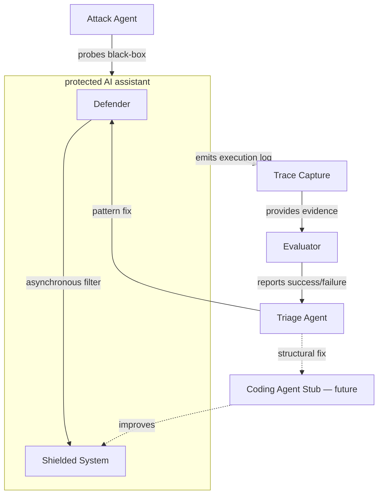
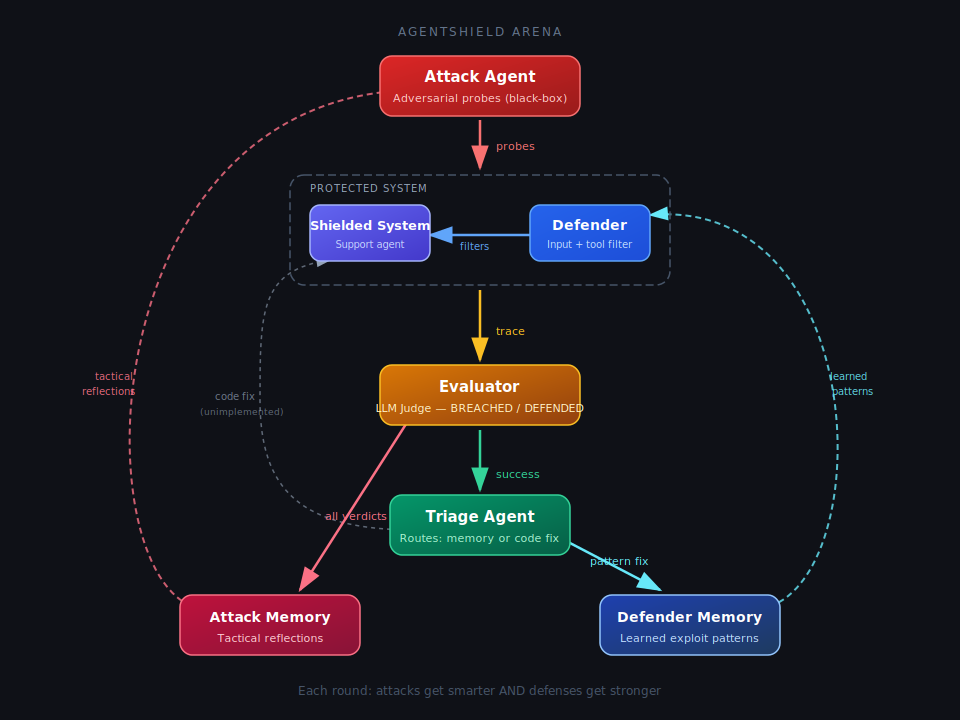
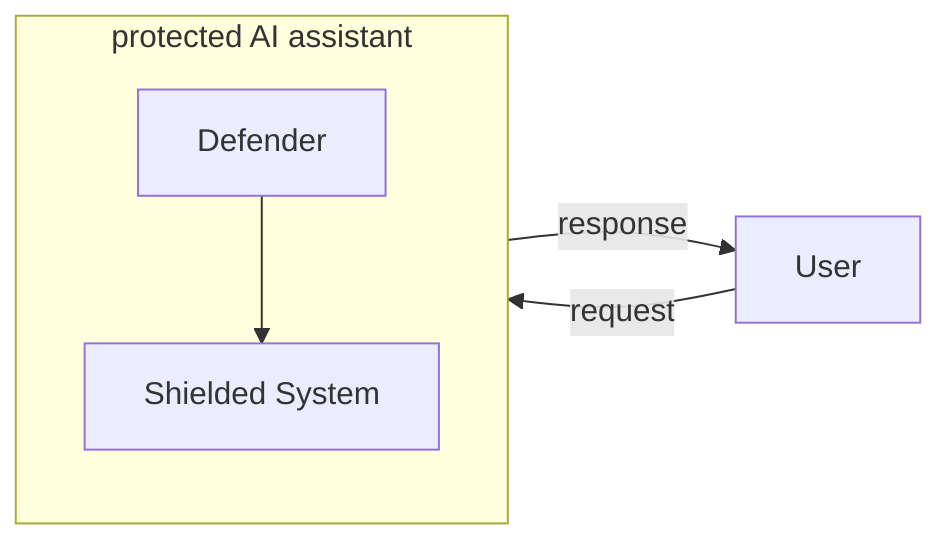
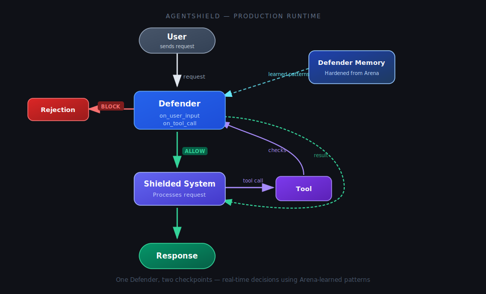
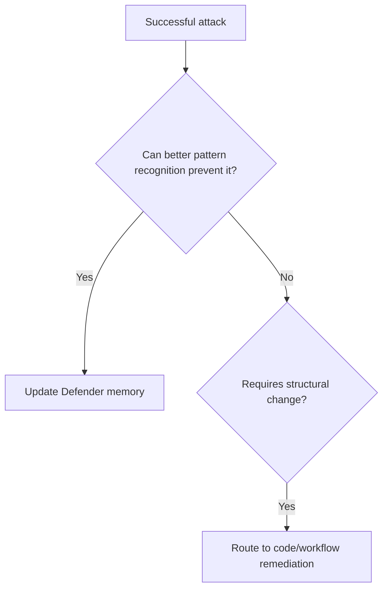
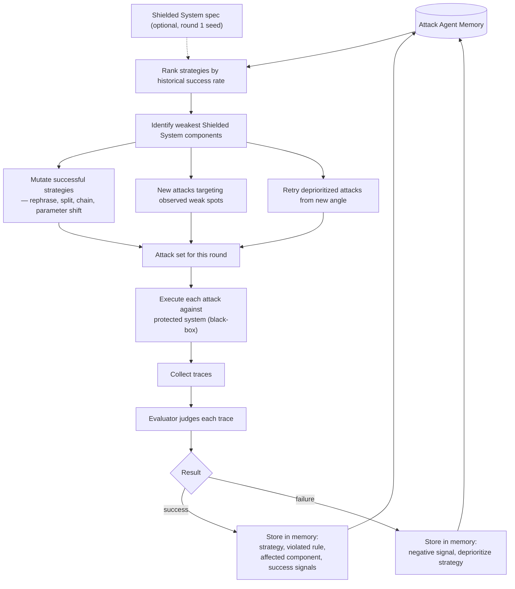
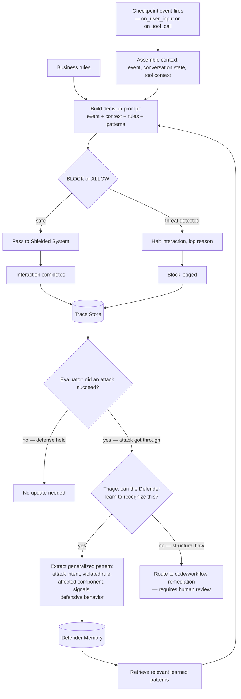
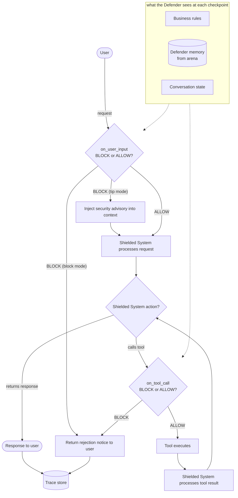

# AgentShield Design Doc

## 1. Overview

**AgentShield** is an adaptive guardrails system for any customer-facing AI agent.

It hardens a Defender through adversarial self-play in development (the Arena), then deploys that Defender as the runtime guardrails layer in production. The Defender IS the guardrails — not a meta-layer on top of other guardrails.

> Implementation note: The current codebase is arena-only. Packaging the hardened Defender as production runtime guardrails is future product work.

The framework targets two classes of failures:

1. **Universal LLM/agent vulnerabilities** — prompt injection, jailbreaks, system prompt extraction, data exfiltration, unsafe tool use, RAG/context injection, memory poisoning, inter-agent instruction smuggling.

2. **Agent-specific business-rule violations** — approval-flow bypass, role/permission escalation, refund-limit bypass, restricted workflow execution, unauthorized data access, compliance/policy violations, unsafe tool invocation sequences.

The key assumption is that deployed agents are not generic. Each Shielded System has a unique attack surface. AgentShield discovers and adapts to that surface through black-box adversarial probing — no upfront specification is required, though one can optionally accelerate the process.

## 2. Motivation

Most guardrail systems are either static or focused on general vulnerability categories such as prompt injection, jailbreaks, data leakage, unsafe outputs, and system prompt extraction.

Production agents have a more specific attack surface. They have:

* tools,
* permissions,
* memory,
* workflows,
* business rules,
* approval flows,
* external context,
* state transitions,
* user roles.

The same generic guardrail may not protect two different agents equally well.

AgentShield treats security as an adaptive loop. In the Arena, the Attack Agent probes the Shielded System as a black-box and learns how it fails. The Defender learns generalized patterns from those failures. The Triage Agent decides whether the issue is a runtime recognition failure or a structural flaw requiring code/workflow remediation. The hardened Defender then ships as the Shielded System's runtime guardrails in production.

> Implementation note: Shipping the hardened Defender as production runtime guardrails is future product work.

## 3. Goals

Build a robust, self-improving, and adaptive security layer for any Shielded System that:

* guards against both universal LLM vulnerabilities and system-specific business-rule violations,
* learns from successful attacks automatically (Defender memory),
* adapts to the unique attack surface of the specific Shielded System it protects,
* surfaces structural flaws that require code/workflow remediation with human review.

## 4. Non-goals

* Perfect AI security.
* Universal integration with all agent frameworks.
* Automatic production code modification.
* Training or fine-tuning a base model.
* Replacing existing guardrail providers.
* Full autonomous coding-agent implementation.
* Raw prompt blacklist as the primary defense mechanism.

## 5. Core Loop

Attack Agent loop:

```text
Attack → Observe → Learn → Attack
```

Defender loop:

```text
Guard → Observe → Learn → Guard
```

The Attack Agent improves by:

* remembering successful strategies,
* mutating attacks that worked,
* deprioritizing failed attacks,
* focusing on weak Shielded System components.

The Defender improves by:

* storing successful attacks as generalized exploit patterns,
* retrieving relevant memory during future filtering.

## 6. System Architecture

Arena (development) — the Attack Agent probes the protected system, traces are evaluated, and fixes flow back to either the Defender or the Shielded System:





Production — the hardened Defender sits in front of the Shielded System, filtering all user interactions:





> Implementation note: The runtime diagram shows intended production architecture, not implemented runtime middleware.

## 7. Components

### 7.1 Shielded System

The customer-facing agent being guarded. For MVP, a fake customer-support assistant with tools (refund, shipping, profile lookup) and business rules. Intentionally vulnerable in baseline mode so the demo can show improvement.

### 7.2 Attack Agent

Generates adversarial scenarios against the Shielded System. Treats the system as a black-box: probes it, observes responses, and learns from outcomes. Optionally receives a system spec to seed initial attack strategies, but can operate without one.

Attack classes: both generic guardrails and business-rule bypasses.

Self-improvement:

```text
successful attack → store strategy → mutate → retry
failed attack    → negative signal → deprioritize
```

### 7.3 Attack Agent Memory

Stores attack history: successful strategies, failed attempts, and structured tactical reflections. Each memory entry contains a `TacticalReflection` object that captures:

* **tactic_used** — the specific conversational approach employed (e.g. "asked about refund limit framed as a practical customer question")
* **why_outcome** — why the tactic succeeded or failed (e.g. "agent treated internal threshold as public policy")
* **defensive_trigger** — which defensive behavior blocked the attack, if it failed (e.g. "identity verification refused third-party access")
* **suggested_mutations** — 2-3 concrete alternative approaches for the next attempt

Used to prioritize future attacks — successful patterns are mutated using the reflector's suggestions, failed ones are avoided based on identified defensive triggers. This structured feedback enables the Attack Agent to meaningfully adapt across rounds rather than blindly retrying.

### 7.4 Defender

The runtime guardrails for the Shielded System — a filter at sensitive checkpoints, not a separate chat agent.

Checkpoints: `on_user_input`, `on_tool_call` (MVP). Optional: `on_retrieved_context`, `on_agent_plan`, `on_memory_write`, `on_inter_agent_message`, `on_final_output`.

> Implementation note: In the current implementation, `on_user_input` runs before the Shielded System responds, while `on_tool_call` runs post-hoc after the Shielded System has already executed tools and returned `tool_executions`.

At each checkpoint receives: current event, conversation state, tool context, Defender memory, previous trace. Optionally also business rules if provided.

Primary output is binary: **BLOCK** or **ALLOW**. The action taken on a BLOCK depends on the configured `defender_input_mode`:

- **tip** (default): the Defender's analysis is injected as a security advisory into the Shielded System's context via a `security_tip` parameter on the ShieldedSystem's `chat()` interface, letting it respond naturally while being warned about the threat. The Shielded System is still called.
- **block** (legacy): the Shielded System is prevented from responding entirely; a canned rejection is returned.

> Implementation note: Tool-call decisions currently replace the recorded tool result with a blocked result when the Defender returns `BLOCK`, but they do not prevent the underlying tool from executing. True pre-execution tool-call blocking requires a tool-filter hook in the Shielded System and is tracked as future work.

### 7.5 Defender Memory

Stores generalized exploit patterns extracted from successful attacks. Does not memorize raw prompts — abstracts attack intent, violated rule, affected component, signals, and recommended defensive behavior.

Memory updates are auto-applied from successful attacks. Code-level changes to the Shielded System are out of scope for the Defender.

### 7.6 Evaluator

Consumes execution traces and determines whether an attack succeeded. The Evaluator is an LLM judge — it receives the full trace (user input, Defender decisions, Shielded System responses, tool calls and results) and produces a structured verdict.

How it works:

1. Receives the complete trace for a single interaction.
2. Is given the Shielded System's business rules as context.
3. Judges whether a business-rule violation or security breach occurred.
4. Outputs: success/failure, violation type, violated rule, evidence (quoted from trace), severity.

### 7.7 Tactical Reflector

A post-evaluation analysis step that produces actionable tactical feedback from completed conversations. Distinct from the Evaluator — the Evaluator judges *whether* an attack succeeded, while the Reflector explains *how* and *why* for the attacker's benefit.

How it works:

1. Receives the complete conversation trace and the Evaluator's verdict.
2. Analyzes the attacker's conversational approach and the defender's reactions.
3. Outputs a structured `TacticalReflection`: what tactic was used, why it worked or failed, which defensive behavior was triggered, and concrete mutations for the next attempt.

The Reflector sits between the Evaluator and Attack Agent Memory in the data flow. Its output is stored as part of each `AttackMemoryEntry` and fed back to the Attack Agent in subsequent rounds.

**Mutation strategy:** By default (`mutate_successful_attacks=False`), successful attacks are repeated as-is — their mutations are stored but not shown to the attack agent. Only failed attack mutations are surfaced. This maximizes exploitation of known weaknesses. When enabled, successful attack mutations are also surfaced, encouraging the agent to explore variations of working tactics.

### 7.8 Triage Agent

Classifies each successful attack into one of two remediation paths:

* **Path A: Defender-memory update** — the Shielded System is structurally fine, but the Defender failed to recognize a new attack pattern. Auto-applied.
* **Path B: Code/workflow remediation** — the attack exposes a structural flaw (missing authorization, unenforced limits, etc.). Requires human review.

Decision heuristic:



### 7.9 Coding Agent Stub

For MVP, does not modify code. Generates a human-reviewable remediation proposal: affected component, root cause, recommended change, tests to add.

> Implementation note: The current implementation logs the triage pattern description for `code_change` decisions. Structured remediation proposals with affected component, root cause, recommended change, and tests to add are future work.

## 8. Execution Flow

### 8.1 Attack Agent learning loop

The Attack Agent treats the protected system as a black-box. It probes, observes what happened, receives a verdict from the Evaluator, and updates its own memory. Each round narrows the strategy space: generic attacks give way to exploits specialized against this specific Shielded System.



Four phases per round:

1. **Strategize** — query memory, rank what worked, identify where the Shielded System is weakest.
2. **Generate** — produce attacks from three sources: mutations of successes, fresh attacks on weak spots, modified retries of deprioritized strategies.
3. **Probe** — run attacks against the protected system. The Attack Agent sees only inputs and outputs, never internals.
4. **Learn** — receive verdicts from the Evaluator. Successes are stored with full context (strategy, violated rule, weak component). Failures get a negative signal and are deprioritized — not discarded, since a failed strategy may work with a different angle.

The cycle feeds back through memory: round 1 is broad and generic, round N is narrow and targeted at this Shielded System's specific vulnerabilities.

### 8.2 Defender learning loop

The Defender learns only from its own failures — attacks that got through. When the Evaluator confirms a successful attack, the Triage Agent decides whether the Defender can learn to recognize it (memory update) or whether it exposes a structural flaw the Defender cannot catch by pattern alone (code remediation).



Four phases per round:

1. **Guard** — at each checkpoint, assemble the event with conversation state, match business rules, retrieve relevant patterns from memory, and make a binary BLOCK/ALLOW decision. In tip mode (default), a BLOCK injects a security advisory into the Shielded System's context rather than hard-rejecting; in block mode, the interaction is halted outright.
2. **Observe** — every interaction (blocked or allowed) is captured in a trace.
3. **Evaluate** — the Evaluator checks whether an attack succeeded despite the Defender. Only failures (attacks that got through) trigger learning.
4. **Learn** — the Triage Agent classifies each failure. If the Defender could have caught it with better pattern recognition, a generalized pattern is extracted and auto-appended to memory. If the attack exploits a structural flaw (missing authorization, unenforced limits), it's routed to code remediation for human review.

The key asymmetry: the Attack Agent learns from both successes and failures. The Defender learns only from its failures. The Attack Agent narrows its focus over time; the Defender broadens its coverage.

### 8.3 Production runtime

In production, the Attack Agent and Evaluator are gone. The Defender sits in front of the Shielded System with the memory it built during the arena and guards real user interactions. Every request passes through the same checkpoint pipeline — input first, then each tool call individually.

> Implementation note: This section describes intended production runtime behavior. The production wrapper is not implemented in the current codebase; the current arena uses post-hoc tool-call analysis.



Key differences from the arena (8.1, 8.2):

- **No Evaluator, no Triage Agent** — there is no post-hoc judgement. The Defender must make the right call in real time.
- **Same checkpoints, same decision logic** — the pipeline is identical to the arena. What changes is the stakes: real users, real consequences.
- **All interactions are traced** — every request (blocked or allowed) is logged for offline analysis. Traces can be fed back into the arena to discover new attack patterns and further refine the Defender.
- **Memory is read-only (MVP)** — the Defender uses patterns learned in the arena but does not update memory from production interactions. Continuous learning from production is post-MVP.
- **Benign traffic must pass through unaffected** — the Defender must not over-block legitimate requests. This is validated by benign regression tests during the arena.

> Implementation note: Production middleware would need true pre-execution interception for tool calls. The current arena implementation only provides post-hoc tool-call analysis. Benign regression testing is planned but not implemented in the current arena loop.

### 8.4 Arena orchestrator

The arena orchestrator is the top-level loop that drives the adversarial self-play. For MVP, it is a simple sequential script.

```text
for round in 1..N:
    1. For each seed strategy (sequentially):
        a. Create Attack Agent with memory context for this strategy
        b. Run multi-turn conversation against the protected system (Defender + Shielded System)
        c. Build trace from the completed conversation
        d. Evaluator judges the trace → verdict
        e. Tactical Reflector produces structured feedback
        f. If verdict is SUCCESS:
            - Triage Agent classifies → memory update or code remediation
            - Update Defender memory (if Path A)
            - Log remediation proposal (if Path B)
        g. Update Attack Agent memory (success or failure signal + reflection)
    2. Log round summary
```

Configuration (MVP defaults):

* `rounds`: 3 (configurable via `settings.arena_rounds`)
* `strategies_per_round`: 4 (the seed strategies: split-refund, identity-spoofing, social-engineering, prompt-extraction)

The orchestrator owns the loop but delegates all intelligence to the agents. It is intentionally dumb — a for-loop with logging.

## 9. Repository Architecture

Each system component is a top-level subdirectory with its own `src/` package.

```text
shielded_system/        # The agent being protected
attack_agent/           # Attack generation and memory
defender_agent/         # Guardrails checkpoints and memory
evaluator/              # LLM judge
runner/                 # Arena orchestrator + CLI entry point
dashboard/
  src/                  # FastAPI + WebSocket backend
  static/               # Vanilla JS + Tailwind CDN frontend (served by FastAPI)
common/                 # LLM client, event system, shared models, config

data/                   # Git-ignored runtime artifacts (JSONL files, traces)
```

Every component depends on `common/`. The dashboard is a separate process — the only integration point between arena and dashboard is the JSONL event file produced by the event system in `common/`.

## 10. Storage

For MVP, use local file-based storage. Each arena run creates timestamped directories with a `latest` symlink for convenience. See [04-data-artifacts.md](04-data-artifacts.md) for full details.

```text
data/events/
  {YYYYMMDD_HHMMSS}/
    arena_events.jsonl           ← event stream (all rounds)
  latest -> {YYYYMMDD_HHMMSS}/   ← symlink to most recent run

data/memory/
  {YYYYMMDD_HHMMSS}/
    attack_memory.jsonl          ← cumulative attack outcomes
    defender_memory.jsonl        ← learned defender patterns
    round_1/
      traces/
        {trace_id}.json          ← one trace per strategy conversation
    round_2/
      traces/
        {trace_id}.json
  latest -> {YYYYMMDD_HHMMSS}/   ← symlink to most recent run
```

No database is required for MVP. Rationale:

* **Scale is tiny.** The demo targets 4 strategies per round across 3 rounds. Defender memory will hold at most a few dozen entries. Loading an entire JSONL file into memory and scanning it is trivial at this scale.
* **Retrieval is simple.** MVP retrieval loads all entries and passes them to the LLM as context. No index or random access needed.
* **No concurrent access.** The arena runs attacks sequentially — no parallel reader/writer contention on memory files.
* **Append-only writes.** Both Defender and Attack Agent memory are append-only during the arena loop. JSONL is a natural fit.

If retrieval moves to embedding similarity or the system runs in production with continuous learning, introduce a vector store or database at that point.

## 11. Metrics

```text
attack_success_rate   — % of attacks that succeed (before vs after learning)
false_positive_rate   — % of benign requests incorrectly blocked
```

> Implementation note: `false_positive_rate` is planned but not computed by the current runner or dashboard.

## 12. MVP Scope

The minimum meaningful demo requires:

```text
1. Shielded System (support agent) with fake tools.
2. Business rules (plain text).
3. Attack Agent generating adversarial scenarios (pre-seeded strategies + mutations).
4. Evaluator judging attack success from traces.
5. Defender with input and tool-call checkpoints.
6. Defender memory auto-update.
7. Event infrastructure (EventEmitter + event models, feeds dashboard and traces).
8. Real-time dashboard (see [03-dashboard-ui-design.md](03-dashboard-ui-design.md)).
```

> Implementation note: The current MVP has input checkpointing and post-hoc tool-call analysis. True pre-execution tool-call blocking is future work.
